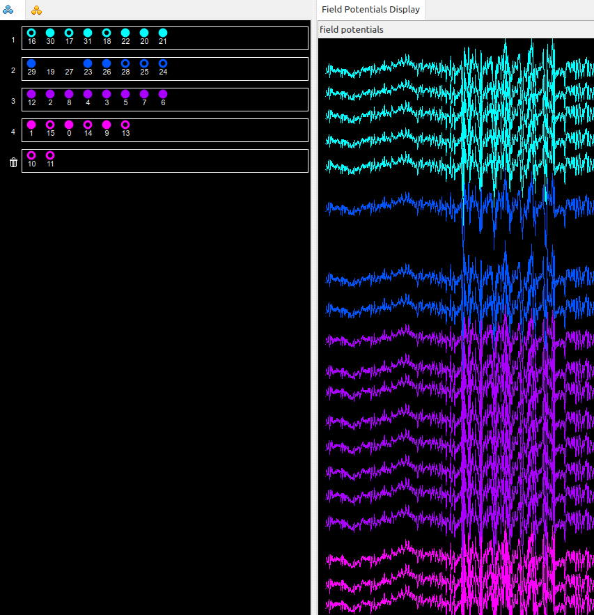
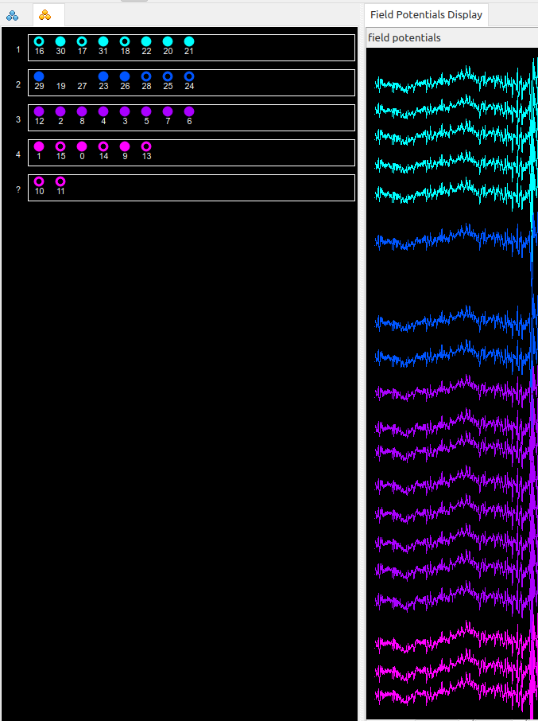

# ephys_preprocessing

Intan → KiloSort 4 → sleep scoring → NWB pipeline for the Peyrache Lab. Works on Linux and Windows.

## 1. Clone the repo

Linux/macOS: open a terminal. Windows: open PowerShell.

```
git clone https://github.com/PeyracheLab/ephys_preprocessing.git
cd ephys_preprocessing
```

(No git? On GitHub use the green **Code** button → **Download ZIP** instead, and unzip it.)

## 2. Set up the environment

Follow **[SETUP.md](SETUP.md)** — one-time setup of the `pp_env` environment and all Python packages. Do this before anything below.

## 3. Running `master_preprocessing.py`

The script lives at `Toolbox/IntanProcessing2/master_preprocessing.py`. Activate `pp_env` first, then run it from inside that folder.

Linux/macOS:
```
source pp_env/bin/activate
cd Toolbox/IntanProcessing2
python master_preprocessing.py B3218 --data-dir /path/to/B3218_recordings --probe Buzsaki64sp
```

Windows:
```
pp_env\Scripts\activate
cd Toolbox\IntanProcessing2
python master_preprocessing.py B3218 --data-dir D:\Data\B3218_recordings --probe Buzsaki64sp
```

### Base behavior (no optional flags)

With just an animal ID, `--data-dir`, and `--probe`, the pipeline runs these steps automatically, in order:

1. Discover the animal's raw Intan session folders
2. Rename/reorganize them into `AnimalID-YYMMDD` intermediate folders
3. Build `Epoch_TS.csv` from the session durations
4. Concatenate all sessions' `.dat` files into one merged recording
5. Copy/merge auxiliary files (analogin, digitalin, auxiliary)
6. Resolve the XML parameter file and update its spike-detection block
7. Run KiloSort 4 (via SpikeSorter), export to Neurosuite
8. Downsample the LFP to a `.eeg` file (`Process_LFPfromDat`)

**Off by default**: sleep scoring and building an `.nwb` file. Both are opt-in — see below.

### The three flags you should basically always set

- **`<animal_id>`** (positional, first argument) — e.g. `B3218`. The code *can* infer this automatically from the session folder names if you leave it out, but always pass it explicitly — it's how the pipeline knows which sessions belong together, and letting it guess is an easy way to silently pick up the wrong recordings.
- **`--data-dir PATH`** — the folder containing that animal's raw Intan session folders. Defaults to your current directory if you don't set it, but always set it explicitly so it's unambiguous exactly what data you're processing, especially when scripting multiple runs.
- **`--probe NAME_OR_PATH`** — e.g. `--probe Buzsaki64sp`, or a path to your own probe JSON. **Always include this.** The code *can* fall back to a generic layout (`--layout`/`--site-spacing`) with no `--probe` at all, but that fallback assumes every shank has an identical channel count and made-up spacing — it is never geometrically correct for real hardware. Only skip `--probe` if you genuinely don't care about spatial-aware sorting.

### Important: the XML must have one anatomical group per shank

The XML's `<anatomicalDescription>` needs **exactly one channel group per physical shank**, in the same order as the shanks in your probe file — and if shanks have *different* channel counts (e.g. one shank carrying extra deep electrodes, like `Buzsaki64sp`), each XML group's size must match that specific shank's count exactly.

Channel order within each group also matters: the convention here is **descending anatomical order — from the top of the probe down to the tip** — for both the XML's channel list and the probe file's `xc`/`yc` arrays. The first channel listed in a shank's group is its topmost electrode, the last is its tip. Both files must agree on this direction; nothing in the code can detect a reversed order on its own, since it doesn't change any channel count.

**Never discard a channel in NeuroScope if you want it excluded from spike sorting — this will break KiloSort's inferred geometry.** Discarding removes the channel from *both* `<anatomicalDescription>` and `<spikeDetection>` when you save, which shrinks that shank's channel count below what the probe file expects. Depending on the mismatch, that either hard-fails the pipeline outright, or — worse — silently shifts every other channel on that shank onto the wrong geometry position. This is the trash-can icon, `Channels → Discard Channels`:



Hiding and Skipping are both fine to use as much as you like — they're purely visual and never touch the XML's channel groups or counts. But if you actually want a channel excluded from spike sorting, select it and use `Channels → Remove Channels from Group` instead. This moves it into the **"?" (Undefined Spike Group)** — it stays in `<anatomicalDescription>` (so the rest of the shank's geometry stays correct) and is simply left out of `<spikeDetection>`, which is exactly what excludes it from KiloSort:



### Flags worth highlighting

- **`--skip-sorting`** — pre-process only; do not run KiloSort 4 at all. Use this if you just want the merged `.dat`/`.xml`/`.eeg` ready without sorting yet.
- **`--no-concatenate`** — do not merge each day's recording bouts into one session; keep each raw bout as its own folder and spike-sort it separately.
- **`--skip-lfp`** — skip the automatic `.eeg` creation (`Process_LFPfromDat`). This step runs by default on every call; use this flag to turn it off.
- **`--sleep-score`** — opt in to automated sleep scoring (`SleepScoreMaster`) after LFP downsampling. Off by default. Requires MATLAB.
- **`--make-nwb`** — opt in to building an `.nwb` file once the pipeline finishes. Off by default. Since this runs right after automated KiloSort 4 sorting, before any manual cluster curation, the file is named `AnimalID-YYMMDD_dirtyClusters.nwb` to make that explicit. If `--sleep-score` was also used, sws/rem/wake epochs are written in as separate pynapple-readable `IntervalSet`s.

### Running sleep scoring only, or NWB only

**Sleep scoring only** — skip spike sorting entirely and just get the `.eeg` + sleep states (e.g. you want sleep architecture quickly, without waiting on KiloSort):

```
python master_preprocessing.py B3218 --data-dir /path/to/B3218_recordings --probe Buzsaki64sp --skip-sorting --sleep-score
```
(Windows: same flags, just use the Windows path/activation shown above.)

LFP downsampling still runs automatically here — sleep scoring needs the `.eeg`. Only add `--skip-lfp` on top of this if you already have a `.eeg` from an earlier run and just want to redo the scoring.

**NWB only** — build or rebuild the `.nwb` for a session you've *already* preprocessed (e.g. after manually curating clusters in Phy/Klusters, or if you forgot `--make-nwb` the first time). This doesn't go through `master_preprocessing.py` — `nwb-builder` installs its own command, `nwb-build`, directly into `pp_env`:

```
nwb-build path/to/AnimalID-YYMMDD
```

This writes `AnimalID-YYMMDD.nwb` (no `_dirtyClusters` suffix — use this once clusters are actually clean) into that same folder. Pass `--force` to overwrite an existing one. Run `nwb-build --help` for optional metadata flags (subject info, session description, brain region per shank, etc.).

#### `nwb-build` flags

- `-o`/`--output PATH` — write the `.nwb` somewhere other than `<session_dir>/<basename>.nwb`.
- `--force` — overwrite the output file if it already exists.
- `--dry-run` — parse everything and print a summary without writing the `.nwb`.
- `--no-position` — skip Position/CompassDirection entirely. Spikes and epochs are still written. **Use this whenever TTL sync failed for a session** — check the console output for a TTL-vs-tracking-frame count mismatch warning. Writing truncated/misaligned position data would look valid but not be, which is worse than having no position data at all: with `--no-position`, the missing tracking is obvious to anyone opening the file; without it, a bad sync can silently look like real behavior.

Tracking / TTL sync:
- `--tracking-frequency HZ` — Optitrack capture frame rate (default: read from the csv header).
- `--ttl-threshold FLOAT` — normalized peak height threshold for TTL pulse detection (default: `0.3`).
- `--mismatch-warn-frac FLOAT` — warn if `|TTL count - frame count|` exceeds this fraction of the larger count (default: `0.01`).

Epochs:
- `--epoch-labels LABEL,LABEL,...` — comma-separated labels for each epoch in `Epoch_TS.csv` order (default: `epoch0`, `epoch1`, ...).

Subject metadata: `--subject-id` (default: parsed from the folder name), `--species` (default `Mus musculus`), `--sex` (default `U`), `--genotype`, `--subject-description`, `--age` (ISO 8601 duration, e.g. `P90D`).

Session metadata: `--session-description`, `--experimenter`, `--lab` (default `Peyrache Lab`), `--institution` (default `McGill University`), `--session-start-time` (ISO 8601 datetime override).

Ephys metadata: `--location` (brain region — one value for all shanks, or a comma-separated list with one entry per shank), `--device-name` (default `silicon_probe`), `--device-description`, `--device-manufacturer`.

### All other flags

- `--output-format {neurosuite,phy}` — spike sorting export format (default: `neurosuite`)
- `--layout {staggered,linear,columns}` — fallback probe geometry if no probe file is found (default: `staggered`)
- `--site-spacing MICRONS` — fallback inter-electrode spacing if no probe file is found (default: `20.0`)
- `--sample-rate HZ` — override the recording sample rate (auto-detected from `info.rhd` by default)
- `--no-analogin` / `--no-digitalin` / `--no-auxiliary` — exclude that auxiliary file type from the merged output
- `--work-dir PATH` — copy data to a fast scratch drive (e.g. NVMe SSD) for processing, then copy results back
- `--keep-work-dir` — don't delete the scratch copy after a successful run
- `--dry-run` — print what would happen without actually doing it
